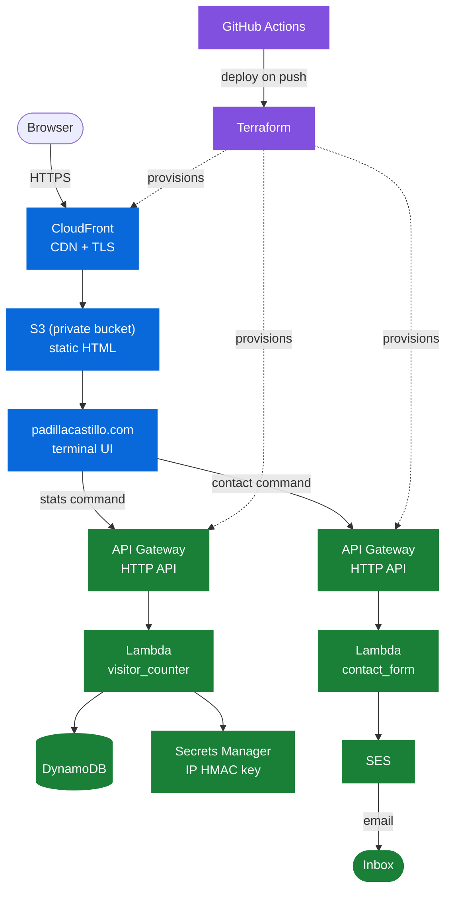

# padillacastillo.com

A personal website styled as an interactive terminal — type `help` once it boots to see what it can do. This README explains how it's built and the reasoning behind each infrastructure decision, the kind of explanation I'd want to give in an interview.

## Architecture



> **🔵 Delivery: how the site reaches your browser**
> - **S3** holds the static file, but it's locked down, so nobody can access it directly
> - **CloudFront** sits in front of it, handles HTTPS, and caches content close to wherever you're browsing from
> - **ACM** provides a free certificate, though it has to live in `us-east-1` no matter where the rest of this runs (CloudFront's one quirky requirement)
> - **Route 53** points `padillacastillo.com` at CloudFront

> **🟢 Backend: visitor stats** — the terminal's `stats` command
> - **API Gateway** is the public URL the command hits
> - **Lambda** runs the Python that hashes the visitor's IP and increments the count
> - **DynamoDB** is where that number (and the set of already-seen visitor hashes) lives, since Lambda does not retain state between runs
> - **Secrets Manager** holds the key used to HMAC each visitor's IP before it's ever written to DynamoDB, so no raw IP is stored

> **🟢 Backend: the contact command** — a second, independent API Gateway/Lambda pair, not part of visitor stats
> - **API Gateway** exposes a `POST /contact` route the terminal submits to, with CORS locked to the site's own origin and a low throttle limit (5 req/s) as a spam brake
> - **Lambda** validates the input and drops anything that trips the honeypot field before it ever reaches SES
> - **SES** sends the email; no database involved, since there's nothing to persist

> **🟣 Pipeline: how it gets built and shipped** (the dotted arrows above show this: it runs when I push code, not when someone visits the site)
> - **Terraform** defines every resource above as code, so nothing gets configured by hand in the console
> - **GitHub Actions** deploys on push, using a short-lived role instead of an AWS key sitting in GitHub secrets

## Why I made these choices

Grouped to match the diagram above. Click a question to expand.

### 🔵 Delivery

<details>
<summary>Why keep the S3 bucket private instead of turning on static website hosting?</summary>

- A public bucket lets anyone bypass CloudFront and hit S3 directly — no caching, no TLS.
- Origin Access Control lets CloudFront read from a private bucket instead, so S3 is never exposed to the internet.
</details>

### 🟢 Backend — visitor stats

<details>
<summary>Why count unique visitors instead of just incrementing on every page load?</summary>

- Incrementing on every load mostly measures my own refreshes while testing, not real traffic.
- The Lambda hashes each request's source IP and only increments the total the first time it sees that hash.
</details>

<details>
<summary>Why HMAC the IP instead of storing it directly, or just hashing it with SHA-256?</summary>

- Storing raw IPs forever is more permanent exposure than a personal site's visitor count needs.
- A plain hash isn't real protection: IPv4 has only ~4.3 billion addresses, so an attacker can precompute a hash for every one and reverse any leaked hash in a lookup.
- HMAC keys the hash with a secret — held in Secrets Manager, never in code or Terraform state — so a leaked value can't be matched back to an IP without that key.
- The same IP still always produces the same HMAC, so dedup still works correctly.
</details>

<details>
<summary>Why keep visitor records forever instead of expiring them with a TTL?</summary>

- "Unique" here means unique for the life of the site, not per day — a TTL would let the same person get re-counted once it expires.
- Storage cost for a personal site's traffic is negligible either way.
</details>

### 🟢 Backend — contact command

<details>
<summary>Why a Lambda-backed contact command instead of a plain <code>mailto:</code> link?</summary>

- A `mailto:` link puts my email address in the page's source in plain text — exactly what spam bots scrape for.
- Routing through Lambda means the address never appears in the source; the browser only ever talks to an API Gateway URL.
- The Lambda drops anything that fills in a honeypot field the terminal always sends empty, filtering out scripts that hit the endpoint directly with generic form-bot payloads.
- The API Gateway route has a low throttle limit, so even a scripted flood gets capped before it reaches my inbox.
- It's independent of the S3/CloudFront/Route 53 hosting work — SES only needs a verified email address, not a verified domain — so it didn't have to wait on that phase to exist.
</details>

### 🟣 Pipeline

<details>
<summary>Why GitHub Actions with OIDC instead of storing an AWS key in repo secrets?</summary>

- A key stored in GitHub secrets doesn't expire on its own — if it ever leaks, it's a standing problem.
- OIDC lets Actions assume a role for the duration of a single run, so there's no long-lived secret to leak in the first place.
</details>

<details>
<summary>Why does <code>.gitignore</code> skip the state files but keep the lock file?</summary>

- State can contain details I don't want sitting in git history, and it lives in a remote backend rather than locally.
- The lock file pins exact provider versions, so `terraform init` on another machine, or in CI, produces the same build I tested locally.
</details>

## Project structure
```
padillacastillo/
  site/
    index.html            the whole site — an interactive terminal; contact and stats are commands, not separate pages
    favicon.svg            browser tab icon
  lambda/
    visitor_counter.py    HMACs the visitor's IP, dedupes, increments the count
    contact_form.py       validates input, sends via SES, drops honeypot hits
  terraform/               every AWS resource above, as code
  .github/workflows/       test.yml (PR checks), deploy.yml (push to main)
```
