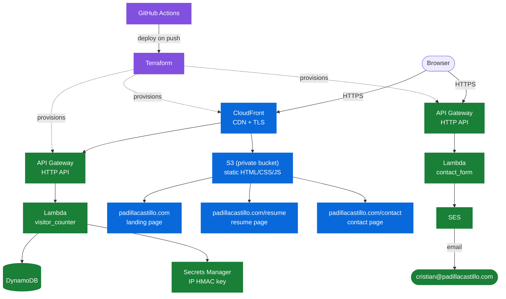

# padillacastillo.com: Cloud Resume Challenge

I built this project to get hands-on experience with AWS, using the [Cloud Resume Challenge](https://cloudresumechallenge.dev/) as a structured way to apply what I've been learning. This README focuses less on how the project works and more on the reasoning behind each decision, the kind of explanation I'd want to give in an interview.

## Architecture



> **🔵 Delivery: how the site reaches your browser**
> - **S3** holds the static files, but it's locked down, so nobody can access it directly
> - **CloudFront** sits in front of it, handles HTTPS, and caches content close to wherever you're browsing from
> - **ACM** provides a free certificate, though it has to live in `us-east-1` no matter where the rest of this runs (CloudFront's one quirky requirement)
> - **Route 53** points `padillacastillo.com` at CloudFront

> **🟢 Backend: the visitor counter**
> - **API Gateway** is the public URL the counter hits
> - **Lambda** runs the Python that hashes the visitor's IP and increments the count
> - **DynamoDB** is where that number (and the set of already-seen visitor hashes) lives, since Lambda does not retain state between runs
> - **Secrets Manager** holds the key used to HMAC each visitor's IP before it's ever written to DynamoDB, so no raw IP is stored

> **🟢 Backend: the contact form** — a second, independent API Gateway/Lambda pair, not part of the visitor counter
> - **API Gateway** exposes a `POST /contact` route the form submits to, with CORS locked to the site's own origin and a low throttle limit (5 req/s) as a spam brake
> - **Lambda** validates the input and drops anything that trips the honeypot field before it ever reaches SES
> - **SES** sends the email; no database involved, since there's nothing to persist

> **🟣 Pipeline: how it gets built and shipped** (the dotted arrows above show this: it runs when I push code, not when someone visits the site)
> - **Terraform** defines every resource above as code, so nothing gets configured by hand in the console
> - **GitHub Actions** deploys on push, using a short-lived role instead of an AWS key sitting in GitHub secrets

## Why I made these choices

**Why HTML instead of just uploading the PDF resume?**
The challenge is specifically about building a website, not hosting a file, so the resume became an actual page.

**Why keep the S3 bucket private instead of turning on static website hosting?**
If the bucket is public, anyone can bypass CloudFront and access S3 directly, with no caching and no TLS. Origin Access Control lets CloudFront talk to a private bucket instead, so S3 itself is never exposed to the internet.

**Why GitHub Actions with OIDC instead of storing an AWS key in repo secrets?**
A key stored in GitHub secrets does not expire on its own, so if it ever leaks, it becomes a standing problem. OIDC lets Actions assume a role for the duration of a single run, which means there is no long-lived secret to leak in the first place.

**Why does `.gitignore` skip the state files but keep the lock file?**
State can contain details I do not want sitting in git history, and it will move to a remote backend eventually. The lock file is different: it pins exact provider versions, so running `terraform init` on another machine, or in CI, produces the same build I tested locally.

**Why a Lambda-backed contact form instead of a plain `mailto:` link?**
A raw `mailto:` link puts my email address in the page's HTML in plain text, which is exactly what spam bots scrape for. Routing it through a form means the address never appears in the source at all — the visitor's browser only ever talks to an API Gateway URL. The Lambda also rejects anything that fills in a honeypot field (a form field that's hidden from real users but visible to bots that auto-fill everything), and the API Gateway route has a low throttle limit, so even a scripted flood gets capped before it reaches my inbox. It's also independent of the S3/CloudFront/Route 53 hosting work — SES only needs a single verified email address, not a verified domain, so it doesn't have to wait on Phase 2 to exist.

**Why count unique visitors instead of just incrementing on every page load?**
A counter that bumps on every load mostly measures my own refreshes during testing, not real traffic. Deduping by visitor is a truer number, so the Lambda hashes each request's source IP and only increments the total the first time it sees that hash.

**Why HMAC the IP instead of storing it directly, or just hashing it with SHA-256?**
Storing raw IPs forever is more permanent exposure than I want sitting in a database for a public site, and a plain hash isn't actually protection: IPv4 only has about 4.3 billion possible addresses, so someone can precompute a hash for every single one and reverse any leaked hash in a lookup. Keying the hash with a secret (HMAC) — that only the Lambda knows, held in Secrets Manager, never in code or Terraform state — closes that off: without the key, the stored value can't be matched back to an IP. It still dedupes correctly, since the same IP always produces the same HMAC.

**Why keep visitor records forever instead of expiring them with a TTL?**
"Unique" is defined here as unique for the life of the site, not unique per day — a TTL would let the same person get re-counted after it expires, which isn't the number I'm after. Storage cost for a resume site's traffic is negligible either way.


## Project structure
```
padillacastillo/
  site/
    index.html            landing page, served at padillacastillo.com/
    resume/index.html     resume page, served at padillacastillo.com/resume
    contact/index.html    contact form, served at padillacastillo.com/contact
    css/style.css         shared stylesheet
    js/contact.js         submits the contact form to API Gateway
    js/visitor-counter.js fetches the unique-visitor count and renders it
  lambda/
    visitor_counter.py    HMACs the visitor's IP, dedupes, increments the count
    contact_form.py       validates input, sends via SES, drops honeypot hits
  terraform/              every AWS resource above, as code
  .github/workflows/      test.yml (PR checks), deploy.yml (push to main)
```

## Status
The landing, resume, and contact pages are written, along with the contact form's backend (Lambda + SES + API Gateway in `terraform/contact_form.tf`), the visitor counter's backend (Lambda + DynamoDB + Secrets Manager + API Gateway in `terraform/visitor_counter.tf`), and static hosting (S3 + CloudFront + ACM + a fresh Route 53 hosted zone in `terraform/hosting.tf` — the domain is registered at Squarespace, so DNS cuts over by pointing Squarespace at the new zone's name servers). None of it is deployed yet — no Terraform has been applied. See `TODO.md` for the working task list, including the exact steps left to apply and verify each piece, and the commit history for what's actually landed once it starts.
