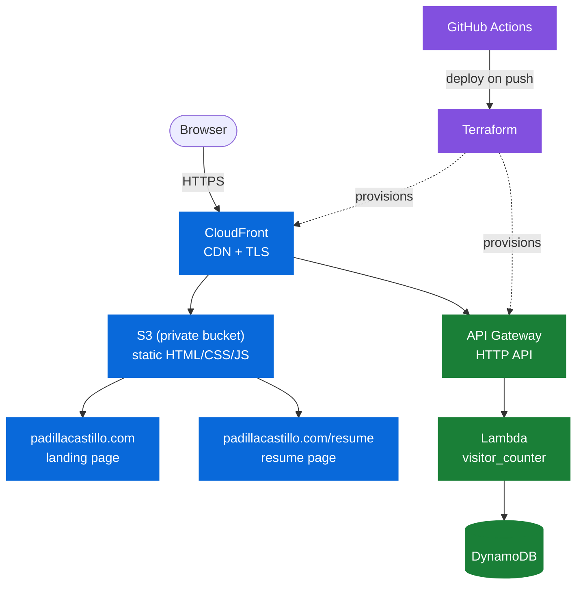

# padillacastillo.com: Cloud Resume Challenge

I built this project to get hands-on experience with AWS, using the [Cloud Resume Challenge](https://cloudresumechallenge.dev/) as a structured way to apply what I've been learning. This README focuses less on how the project works and more on the reasoning behind each decision, the kind of explanation I'd want to give in an interview.

## Architecture



> **🔵 Delivery: how the site reaches your browser**
> - **S3** holds the static files, but it's locked down, so nobody can access it directly
> - **CloudFront** sits in front of it, handles HTTPS, and caches content close to wherever you're browsing from
> - **ACM** provides a free certificate, though it has to live in `us-east-1` no matter where the rest of this runs (CloudFront's one quirky requirement)
> - **Route 53** points `padillacastillo.com` at CloudFront

> **🟢 Backend: the visitor counter**
> - **API Gateway** is the public URL the counter hits
> - **Lambda** runs the Python that increments the count
> - **DynamoDB** is where that number lives, since Lambda does not retain state between runs

> **🟣 Pipeline: how it gets built and shipped** (the dotted arrows above show this: it runs when I push code, not when someone visits the site)
> - **Terraform** defines every resource above as code, so nothing gets configured by hand in the console
> - **GitHub Actions** deploys on push, using a short-lived role instead of an AWS key sitting in GitHub secrets

## Why I made these choices

**Why HTML instead of just uploading the PDF resume?**
The challenge is specifically about building a website, not hosting a file, so the resume became an actual page.

**Why keep the S3 bucket private instead of turning on static website hosting?**
If the bucket is public, anyone can bypass CloudFront and access S3 directly, with no caching and no TLS. Origin Access Control lets CloudFront talk to a private bucket instead, so S3 itself is never exposed to the internet.

**Why write Terraform instead of building it through the console first?**
Mainly because I did not want to build it twice. Starting in the console usually means redoing the same work in code later, and configuration drifts in the meantime, leaving resources that exist but are not documented anywhere. I am building this piece by piece, applying a few resources at a time, so I learn the AWS and Terraform sides together instead of learning one and translating it afterward.

**Why GitHub Actions with OIDC instead of storing an AWS key in repo secrets?**
A key stored in GitHub secrets does not expire on its own, so if it ever leaks, it becomes a standing problem. OIDC lets Actions assume a role for the duration of a single run, which means there is no long-lived secret to leak in the first place.

**Why local state for now instead of a remote backend?**
Local state works fine while I am still getting the core design right. Once the project works end to end, I will move state to S3 with a DynamoDB lock table so it survives a lost laptop and CI can run applies as well. That migration is planned next, not skipped.

**Why is this its own repo, separate from the notary business project?**
The two projects only share AWS and Terraform patterns; everything else is different. Keeping them separate means a mistake in one Terraform state cannot affect the other, and each project gets its own GitHub Actions role scoped to its own resources. It also keeps this repository focused on the resume challenge instead of mixed in with a live business.

**Why does `.gitignore` skip the state files but keep the lock file?**
State can contain details I do not want sitting in git history, and it will move to a remote backend eventually. The lock file is different: it pins exact provider versions, so running `terraform init` on another machine, or in CI, produces the same build I tested locally.

## Project structure
```
padillacastillo/
  site/
    index.html            landing page, served at padillacastillo.com/
    resume/index.html     resume page, served at padillacastillo.com/resume
  lambda/                 visitor_counter.py
  terraform/              every AWS resource above, as code
  .github/workflows/      test.yml (PR checks), deploy.yml (push to main)
```

## Status
Nothing's built yet. This README documents the target architecture; the actual build starts with the S3/CloudFront foundation and moves piece by piece from there. See `TODO.md` for the working task list, and the commit history for what's actually landed once it starts.
